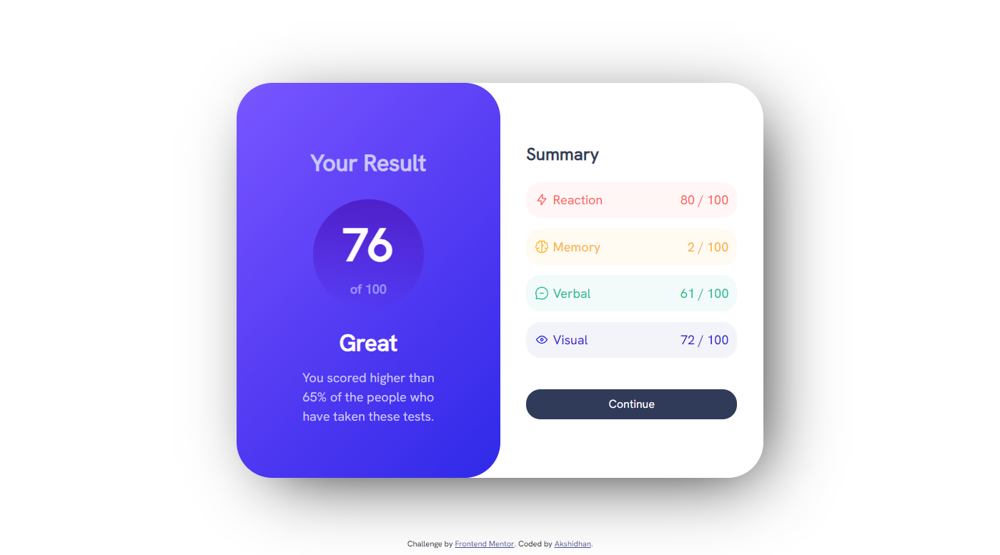

# Frontend Mentor - Results summary component solution

This is a solution to the [Results summary component challenge on Frontend Mentor](https://www.frontendmentor.io/challenges/results-summary-component-CE_K6s0maV). Frontend Mentor challenges help you improve your coding skills by building realistic projects. 

## Table of contents

- [Overview](#overview)
  - [The challenge](#the-challenge)
  - [Screenshot](#screenshot)
  - [Links](#links)
- [My process](#my-process)
  - [Built with](#built-with)
  - [What I learned](#what-i-learned)
  - [Continued development](#continued-development)
  - [Useful resources](#useful-resources)
- [Author](#author)

**Note: Delete this note and update the table of contents based on what sections you keep.**

## Overview

### The challenge

Users should be able to:

- View the optimal layout for the interface depending on their device's screen size
- See hover and focus states for all interactive elements on the page
- **Bonus**: Use the local JSON data to dynamically populate the content

### Screenshot



### Links

- Solution URL: [Solution URL](https://github.com/Akshidhan/results-summary-component-main)
- Live Site URL: [Live site URL](https://akshidhan.github.io/results-summary-component-main/)

## My process

### Built with

- Semantic HTML5 markup
- CSS custom properties
- Flexbox

### What I learned

I properly learned how to use Flexbox to layout the components in a website. I also got to know that you can individually control the border radius of each corner.

```css
.flexbox{
  display: flex;
  flex-direction: row;
}  
```
```css
.borderradius{
  border-bottom-left-radius: 50px;
  border-bottom-right-radius: 50px;
}
```

### Continued development

Can use Javascript to dynamically change the values that are found in the design

### Useful resources

- [CSS Flexbox](https://www.w3schools.com/css/css3_flexbox.asp) - This helped me to properly understand CSS FLexbox. This drastically improved my layouts

## Author

- Website - Akshidhan(https://github.com/Akshidhan)
- Frontend Mentor - @Akshidhan(https://www.frontendmentor.io/profile/Akshidhan)
